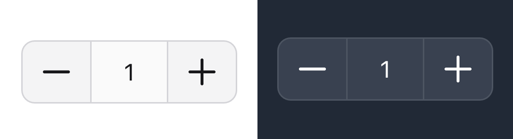

# Number Input Counter for Filament

<p align="center">
  
</p>

[](https://packagist.org/packages/vicmans/filament-number-input)
[](https://github.com/vicmans/filament-number-input/actions?query=workflow%3Arun-tests+branch%3Amain)
[](https://github.com/vicmans/filament-number-input/actions?query=workflow%3A"Fix+PHP+code+styling"+branch%3Amain)
[](https://packagist.org/packages/vicmans/filament-number-input)

Just another quantity input number counter field for Filament.

## Installation

You can install the package via composer:

```bash
composer require vicmans/filament-number-input
```

Add the following line to `tailwind.config.js` inside the content section

```js
export default {
  presets: [],
  content: [
    ...
    './vendor/vicmans/filament-number-input/resources/views/*.blade.php',
  ],
  theme: {
    extend: {},
  },
  plugins: [],
}
```

Optionally, you can publish the views using

```bash
php artisan vendor:publish --tag="filament-number-input-views"
```

and you can edit the component.

## Usage

```php
use Vicmans\FilamentNumberInput\FilamentNumberInput;

protected function form(): array
{
    return [
        ...
        FilamentNumberInput::make('quantity')
            ->minValue(1)
            ->maxValue(20)
            ->minusIcon('heroicon-o-arrow-left')
            ->default(5);
        ...
    ];
}
```

### Methods and Props

| Method | Description | Default Value | Usage|
|----|----|----|----|
| step | Set interval for number input field | `1` | `step(2)`|
| default | Default value | `0` |  `default(5)` |
| maxValue | The max value that allow the user to input | | `maxValue(10)` |
| minValue | The min value that allow the user to input | | `minValue(2)` 
| disableManualInput | User can type the input | `false` | `disableManualInput()` <br/>  This disable manual input, user can change the value using buttons. |
| minusIcon | Decrease button icon |  | `minusIcon('heroicon-o-minus')` |
| plusIcon | Increase button icon |  | `plusIcon('heroicon-o-plus')` |

Other methods from Filament Forms Field.

## Testing

```bash
composer test
```

## Changelog

Please see [CHANGELOG](CHANGELOG.md) for more information on what has changed recently.

## Contributing

Please see [CONTRIBUTING](.github/CONTRIBUTING.md) for details.

## Security Vulnerabilities

Please review [our security policy](../../security/policy) on how to report security vulnerabilities.

## Credits

- [vicmans](https://github.com/vicmans)
- [All Contributors](../../contributors)

## License

The MIT License (MIT). Please see [License File](LICENSE.md) for more information.